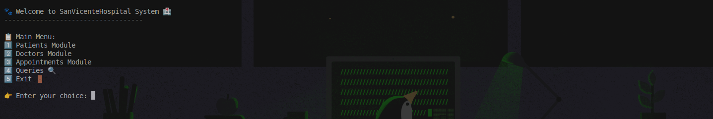
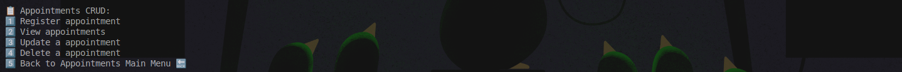

# 🏥 San Vicente Hospital

A medical appointment management system developed in **C# (.NET 8)** that allows patients and doctors to efficiently manage appointments in a centralized way, with automatic email notifications.

---

## 📘 Overview

**San Vicente Hospital** is a console-based application that manages the complete flow of medical appointments:

- **Patients** can register, modify, or check their appointments.  
- **Doctors** can view and organize their schedules.  
- The system automatically sends **email confirmation messages** after creating an appointment.  
- All information is stored in memory using a **simulated in-memory database**.

Ideal as a foundation for educational projects, demonstrations, or the development of more complex medical management systems.

---

## ⚙️ Prerequisites

Before running the project, make sure you have installed:

- 🧩 [.NET SDK 8.0](https://dotnet.microsoft.com/download)

---

## 🚀 Installation and Execution

Follow these steps to clone, configure, and run the application:

### 1️⃣ Clone the Repository
```bash
git clone https://github.com/SebastianRdev/SanVicenteHospital.git
````

### 2️⃣ Navigate to the Project Directory

```bash
cd SanVicenteHospital
```

### 3️⃣ Restore Dependencies

```bash
dotnet restore
```

### 4️⃣ Run the Application

```bash
dotnet run
```

---

## 💻 Technologies Used

| Component                | Description                                            |
| ------------------------ | ------------------------------------------------------ |
| **C# / .NET 8**          | Core language and framework                            |
| **In-Memory Database**   | Simulated storage using dictionaries and lists         |
| **Dependency Injection** | Manages dependencies between services and repositories |
| **Console UI**           | Console-based user interface                           |
| **Email Service**        | Simulated email sending functionality                  |

---

## 📸 Screenshots

*(You can add your screenshots here once the application is running)*

| Main Menu                                  | Appointment CRUD                               |
| ------------------------------------------ | ---------------------------------------------- |
|  |  |

---

## 👨‍💻 Developer Information

| Field         | Details                                                       |
| ------------- | ------------------------------------------------------------- |
| **Name**      | Sebastian Reyes                                               |
| **Clan**      | Caiman                                                        |
| **Email**     | [sebastianrdev@outlook.com](mailto:sebastianrdev@outlook.com) |
| **ID Number** | 123456789                                                     |

---

## 🧠 Technical Notes

* The system is built with an architecture based on **repositories and services**, separating business logic from the user interface.
* Data is stored in memory (in `Database.cs`) to simplify execution.
* Emails are handled through the `EmailService`, which centralizes logic and prevents duplication within the UI layer.

---
